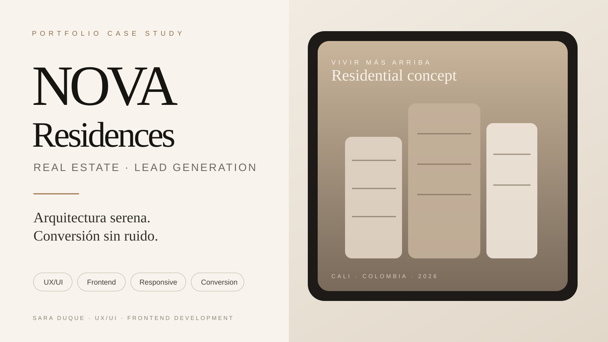

<p align="center">
  
</p>

<h1 align="center">NOVA Residences</h1>

<p align="center">
  Premium real-estate landing page case study focused on lead generation, UX/UI and responsive frontend development.
</p>

<p align="center">
  <a href="https://nova-residences-landing.vercel.app"><strong>Live Demo</strong></a>
  ·
  <a href="./docs/PROJECT_BRIEF.md">Project Brief</a>
  ·
  <a href="./docs/CONVERSION_PLAN.md">Conversion Plan</a>
  ·
  <a href="./docs/QA_REPORT.md">QA Report</a>
</p>

<p align="center">
  
  
  
  
  
</p>

---

## Overview

**NOVA Residences** is a fictional real-estate concept created as a portfolio case study. The landing page explores how an editorial architectural identity can support a conversion-oriented funnel without relying on fake urgency, fabricated testimonials or misleading sales claims.

The experience guides campaign traffic from aspiration to product understanding, objection handling and a final visit-booking interaction.

### Project goals

- Communicate a premium residential proposition with a distinct visual identity.
- Convert paid-campaign traffic into qualified visit intent.
- Demonstrate responsive UX/UI and production frontend implementation.
- Use interaction and motion to improve clarity rather than decoration.
- Keep all fictional commercial data clearly identified as demonstrative.

## Experience highlights

- **Editorial real-estate art direction** with custom NOVA architectural artwork.
- **Interactive typology explorer** for N01, N02 and N03 conceptual floor plans.
- **Amenities and location storytelling** designed around perceived product value.
- **Interactive financing scenario** with explicit non-financial disclaimer.
- **Lead-capture demo** with required-field validation and accessible success feedback.
- **Downloadable concept brochure** for a realistic acquisition funnel.
- **Mobile conversion CTA**, keyboard focus states and reduced-motion support.
- **SEO metadata**, canonical URL, sitemap, robots metadata and social preview image.

## Conversion flow

```text
Campaign traffic
      ↓
Premium hero + clear value proposition
      ↓
Product understanding / typologies
      ↓
Amenities + visual proof + location context
      ↓
Financial scenario / objection reduction
      ↓
Visit intent
      ↓
Lead form / local demo confirmation
```

The primary CTA is **Agendar visita**. Secondary actions support consideration without competing with the main conversion path.

## Stack

| Area | Technology |
| --- | --- |
| Framework | Next.js 16 · App Router |
| UI | React 19 |
| Language | TypeScript |
| Styling | Tailwind CSS 4 |
| Motion | Motion for React + CSS transitions |
| Deployment | Vercel |
| CI | GitHub Actions |

## UX, accessibility & interaction

The interface was reviewed against the repository's interaction and accessibility guidance. It includes semantic sectioning, native form controls, keyboard-visible focus, meaningful labels, touch-friendly CTAs and `prefers-reduced-motion` handling.

The final QA also corrected the lead form so empty or invalid required fields cannot produce a false success state, and moves focus to the confirmation state after a valid demo submission.

## SEO & production readiness

NOVA includes:

- canonical production URL;
- Open Graph and Twitter metadata;
- generated social preview artwork;
- application icon;
- `robots.txt` metadata route;
- `sitemap.xml` metadata route;
- production deployment from GitHub `main`;
- automated lint, typecheck and build checks.

See the complete verification record in [`docs/QA_REPORT.md`](./docs/QA_REPORT.md).

## Run locally

```bash
npm install
npm run dev
```

Open `http://localhost:3000`.

### Quality checks

```bash
npm run lint
npm run typecheck
npm run build
```

## Repository structure

```text
app/                    Next.js routes, metadata and global styles
components/             Interactive UI modules
public/                 Hero artwork, floor plans and brochure
lib/                    Shared project data
.agents/skills/         Repository-scoped Codex skills
docs/                   Brief, conversion plan, design direction and QA
.github/workflows/      Continuous integration
```

## Codex-ready workflow

Repository guidance lives in `AGENTS.md`, with scoped skills under `.agents/skills/`:

- `apple-interaction-audit`
- `conversion-landing`
- `responsive-accessibility`
- `seo-performance`
- `motion-polish`

The Apple-inspired interaction audit is intentionally used for **interaction quality on an existing UI**, not as a visual-style template.

## Branch model

`main` → stable production  
`develop` → integration  
`feature/*` / `chore/*` → isolated work

## Portfolio integrity

NOVA Residences is a **fictional portfolio concept**. Pricing, availability, delivery dates, location details, floor plans and financial scenarios are demonstrative. They do not represent a real-estate offer, quotation, promise of sale or financial recommendation.

---

<p align="center">
  Designed and developed by <strong>Sara Duque</strong><br/>
  UX/UI · Frontend Development · Software
</p>
